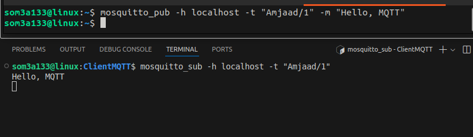

# IoT MQTT Documentation

## Overview

MQTT (Message Queuing Telemetry Transport) is a lightweight messaging protocol designed for low-bandwidth, high-latency, or unreliable networks. It is commonly used in IoT applications to enable communication between devices.

## Table of Contents

- [Overview](#overview)
- [Key Features](#key-features)
- [MQTT Architecture](#mqtt-architecture)
- [Quality of Service (QoS)](#quality-of-service-qos)
- [Using MQTT](#using-mqtt)
  - [Installing an MQTT Broker](#installing-an-mqtt-broker)
  - [Connecting Clients to Public Broker](#connecting-clients-to-public-broker)
  - [Starting Broker with Mosquitto](#starting-broker-with-mosquitto)
  - [Connecting Clients to Local Broker](#connecting-clients-to-local-broker)
  - [Using Command-Line Client](#using-command-line-client)
- [TLS Overview](#tls-overview)
- [Anonymous Mode and TLS in Mosquitto](#anonymous-mode-and-tls-in-mosquitto)
  - [Anonymous Mode](#anonymous-mode)
  - [Using TLS](#using-tls)
  - [Recommended Practice](#recommended-practice)
- [Configuring TLS with mkcert](#configuring-tls-with-mkcert)
  - [Installing mkcert](#installing-mkcert)
  - [Generate Certificates](#generate-certificates)
  - [Configuring Mosquitto for TLS](#configuring-mosquitto-for-tls)
  - [Test Publishing a Message](#test-publishing-a-message)
  - [Test Subscribing to a Topic](#test-subscribing-to-a-topic)
- [Anonymous Mode Off](#anonymous-mode-off)
  - [User Authentication](#user-authentication)
  - [Testing the Authentication](#testing-the-authentication)
- [References](#references)

## Key Features

- **Lightweight**: Minimal overhead, suitable for constrained devices.
- **Publish/Subscribe Model**: Decouples producers and consumers of data.
- **Quality of Service Levels**: Three levels of message delivery guarantees.
- **Last Will and Testament**: Notifies subscribers if a client disconnects unexpectedly.

## MQTT Architecture

MQTT operates on a client-server model:

- **Broker**: Central server that manages communication between clients.
- **Client**: Any device that connects to the broker to publish or subscribe to topics.

### Topics

Topics are channels through which messages are sent, structured hierarchically (e.g., `home/livingroom/temperature`).

## Quality of Service (QoS)

MQTT defines three levels of QoS:

- **QoS 0**: At most once (no acknowledgment).
- **QoS 1**: At least once (message is acknowledged).
- **QoS 2**: Exactly once (ensures message delivery without duplication).

## Using MQTT

### Installing an MQTT Broker

You can install an MQTT broker like Mosquitto on your local machine or use a cloud-based broker like HiveMQ.

#### Example Installation (Mosquitto)

```bash
# On Ubuntu
sudo apt update
sudo apt install mosquitto mosquitto-clients
```

### Connecting Clients to Public broker

Clients can be written in various programming languages. Libraries are available for Python, JavaScript, C, and C++

#### Example in Python for client connecting with HiveMQ broker:

```
pip3 install paho-mqtt
```

```
import paho.mqtt.client as mqtt

# Callback when the client receives a CONNACK response from the server.
def on_connect(client, userdata, flags, rc):
    print("Connected with result code " + str(rc))
    client.subscribe("test/topic")

# Callback for when a message is received from the server.
def on_message(client, userdata, msg):
    print(f"{msg.topic} {msg.payload.decode()}")

client = mqtt.Client()
client.on_connect = on_connect
client.on_message = on_message

client.connect("broker.hivemq.com", 1883, 60)
client.loop_forever()

```

### Starting broker with Mosquitto

```
 # On Ubuntu , it will auto start after installing it
sudo systemctl start mosquitto
# Enable it to start on boot
sudo systemctl enable mosquitto

```

### Connecting Clients to local Broker

You can connect to your Mosquitto broker using the command-line client or via a Python client.

### Using Command-Line Client

To publish a message:

```
mosquitto_pub -h localhost -t "test/topic" -m "Hello, MQTT"
```

To subscribe to a topic:

```
mosquitto_sub -h localhost -t "test/topic"
```




## TLS Overview

TLS (Transport Layer Security) ensures secure communication by encrypting data, authenticating parties, and maintaining integrity. It protects against unauthorized access and attacks, making it essential for secure IoT and MQTT applications.

## Anonymous Mode and TLS in Mosquitto

Mosquitto allows for the configuration of anonymous connections alongside TLS (Transport Layer Security). Understanding how these settings interact is crucial for maintaining the security of your MQTT broker.

### Anonymous Mode

- **Anonymous Mode True (`allow_anonymous true`)**:

  - Clients can connect to the Mosquitto broker without authentication (username and password).
  - This option can be useful for development and testing purposes, making it easier to connect quickly.
- **Anonymous Mode False (`allow_anonymous false`)**:

  - Clients must provide valid credentials to connect.
  - This setting enhances security, ensuring that only authorized users can publish or subscribe to topics.

### Using TLS

When TLS is enabled, it provides encryption for the data transmitted between the client and the broker. However, if anonymous mode is also enabled, the following points must be considered:

- **Functionality**:

  - Clients can establish a secure TLS connection without needing to authenticate if anonymous mode is enabled. This means that any client capable of making a TLS connection can potentially access your broker.
- **Security Implications**:

  - Allowing anonymous access can expose your broker to unauthorized connections. Even with encryption, it may lead to situations where untrusted clients can publish or subscribe to sensitive topics.

### Recommended Practice

For production environments, it is advisable to disable anonymous mode when using TLS to enhance security:

```conf
listener 8883
cafile /path/to/your/cafile
certfile /path/to/your/certfile
keyfile /path/to/your/keyfile

allow_anonymous false  # Requires authentication for all connections
```


## Configuring TLS with mkcert

### 1.Installing mkcert

```
sudo apt install mkcert
```

mkcert will generate a certificate  to be used as a trusted one localy

```
mkcert -install
```

### 2.**Generate Certificates** :

Use `mkcert` to create a certificate for your localhost:

```
mkcert -cert-file mosquitto.crt -key-file mosquitto.key localhost

```

```
sudo mv path/cert/mosquitto.crt /etc/mosquitto/certs/
sudo mv path/cert/mosquitto.key /etc/mosquitto/certs/
```

### 3.Configuring Mosquitto for TLS with Anonymous mode on

 **Edit the Mosquitto Configuration File** :

Locate the Mosquitto configuration file, usually found at `/etc/mosquitto/mosquitto.conf`.

```
listener 8883
certfile /path/to/mosquitto.crt
keyfile /path/to/mosquitto.key
```


### 4. Test Publishing a Message

You can publish a message to the broker using TLS with the following command:

```
mosquitto_pub -h localhost -p 8883 -t "test/topic" -m "Hello, MQTT with TLS!" --cafile /etc/mosquitto/certs/mosquitto.crt
```

### 5. Test Subscribing to a Topic

```
mosquitto_sub -h localhost -p 8883 -t "test/topic" --cafile /etc/mosquitto/certs/mosquitto.crt

```


### Anonymous mode Off

### User Authentication

To create a password file, you can use the `mosquitto_passwd` tool:

```
mosquitto_passwd -c /etc/mosquitto/passwd username

```

**Update Your Mosquitto Configuration** :
Ensure your Mosquitto configuration file includes the path to the password file:

```
password_file /etc/mosquitto/passwd
```

### Testing the Authentication

You can test the authentication by using the `mosquitto_pub` and `mosquitto_sub` commands with the `-u` and `-P` options to specify the username and password:

* **Publish a message** :

```
mosquitto_pub -h localhost -p 8883 -t "test/topic" -m "Hello World" -u username -P password --cafile /path/to/cafile
```

* **Subscribe to a topic** :

  ```
  mosquitto_sub -h localhost -p 8883 -t "test/topic" -u username -P password --cafile /path/to/cafile

  ```

### Importance of TLS in Production

* **Data Encryption** : Protects sensitive information from eavesdropping.
* **Authentication** : Verifies the identities of clients and servers.
* **Data Integrity** : Ensures data remains unchanged during transmission.
* **Regulatory Compliance** : Meets legal security requirements (e.g., GDPR, HIPAA).
* **User Trust** : Builds confidence in your system’s security.


## Refrences

**HiveMQ Secuirty Doc** :[https://docs.hivemq.com/hivemq/latest/user-guide/security]()

**IoT MQTT Documentation:** [https://mqtt.org/](https://mqtt.org/)

**Paho MQTT:** [https://github.com/eclipse/paho.mqtt.python](https://github.com/eclipse/paho.mqtt.python)

**Mosquitto Client:** [https://github.com/eclipse/mosquitto](https://github.com/eclipse/mosquitto)

**mkcert Documentation** :  [https://github.com/FiloSottile/mkcert]()
