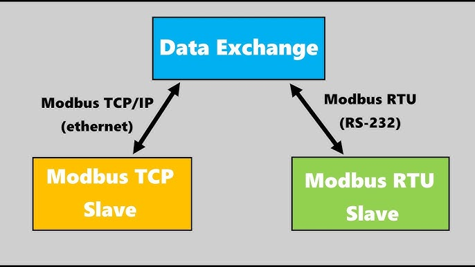

## Modbus TCP

Modbus TCP is a widely used communication protocol in industrial automation, designed for communication between control systems, such as PLCs, and remote devices. Modbus TCP extends the traditional Modbus protocol to use Ethernet and TCP/IP for communication.

### 1. **Overview of Modbus**

Modbus is a communication protocol originally developed by Modicon (now Schneider Electric) in 1979 for use with PLCs. It is an open standard, making it widely adopted in industrial networks for data transfer and control.

#### Types of Modbus

1. **Modbus RTU (Remote Terminal Unit)** – Used for communication over serial links (RS-232, RS-485).
2. **Modbus ASCII** – Similar to Modbus RTU but uses ASCII characters for communication.
3. **Modbus TCP/IP** – Extends the protocol to run over Ethernet, utilizing the TCP/IP stack.

### 2. **Modbus TCP Protocol**

Modbus TCP (also known as Modbus TCP/IP) is a version of the Modbus protocol that runs on Ethernet networks. The communication takes place over TCP/IP, making it compatible with standard networking infrastructure.

#### Key Characteristics:

* **Transport Protocol** : TCP (Transmission Control Protocol)
* **Port** : 502 (default port for Modbus TCP communication)
* **Layer** : Operates at Layer 4 (Transport Layer) of the OSI model.
* **Request/Response** : Modbus TCP follows a client-server (or master-slave) architecture, where the client (master) sends a request and the server (slave) responds.

### 3. **Modbus TCP Frame Structure**

Modbus TCP frames are different from Modbus RTU frames because they include extra fields for TCP communication but retain the core Modbus protocol.

**Frame Structure:**

```
| Transaction ID (2 bytes) | Protocol ID (2 bytes) | Length (2 bytes) | Unit ID (1 byte) | Function Code (1 byte) | Data (n bytes) |

```


1. **Transaction ID (2 bytes)** : Used to match the response with the request.
2. **Protocol ID (2 bytes)** : Always 0 for Modbus TCP (reserved for future use).
3. **Length (2 bytes)** : Specifies the remaining length of the message.
4. **Unit ID (1 byte)** : Identifies the slave device (also used in gateways for Modbus RTU over TCP).
5. **Function Code (1 byte)** : Identifies the Modbus function (e.g., read, write).
6. **Data (n bytes)** : Contains the data or parameters for the Modbus function.

### 4. **Modbus TCP Functions**

Modbus TCP supports several functions to interact with coils, registers, and devices. The most common function codes are:

* **01** : Read Coils (digital outputs)
* **02** : Read Discrete Inputs (digital inputs)
* **03** : Read Holding Registers (analog output values)
* **04** : Read Input Registers (analog input values)
* **05** : Write Single Coil
* **06** : Write Single Holding Register
* **15** : Write Multiple Coils
* **16** : Write Multiple Holding Registers

### 5. **Modbus TCP Communication Workflow**

1. **Connection Establishment** : The client establishes a TCP connection to the server on port 502.
2. **Request Transmission** : The client sends a Modbus request with a function code (e.g., to read coils).
3. **Processing by Server** : The server processes the request and retrieves the required data.
4. **Response Transmission** : The server sends back the requested data or acknowledgment.
5. **Connection Termination** : The TCP connection is closed, or it may remain open for subsequent requests.

### 6. **Common Use Cases for Modbus TCP**

* **Supervisory Control and Data Acquisition (SCADA)** : SCADA systems often use Modbus TCP to communicate with remote field devices.
* **Remote Monitoring** : Industrial control systems can monitor sensors and actuators across the factory floor using Modbus TCP.
* **Programmable Logic Controllers (PLCs)** : PLCs frequently use Modbus TCP for data exchange between control devices.


### 7. **Modbus TCP vs. Modbus RTU**




| Feature                        | Modbus TCP                   | Modbus RTU                          |
| ------------------------------ | ---------------------------- | ----------------------------------- |
| **Communication Medium** | Ethernet (TCP/IP)            | Serial (RS-232, RS-485)             |
| **Speed**                | Higher (Ethernet speeds)     | Limited by serial line speed        |
| **Network Layer**        | OSI Layer 4 (TCP)            | OSI Layer 2 (Data Link)             |
| **Frame Format**         | Includes extra TCP/IP header | Simple serial frame format          |
| **Transport**            | Client-server                | Master-slave                        |
| **Port**                 | TCP 502                      | No specific port                    |
| **Connection**           | Persistent connection        | One request per communication cycle |

### 8. **Security Considerations**

Since Modbus TCP runs over Ethernet, it is vulnerable to common network attacks like man-in-the-middle, replay, and sniffing. Some recommendations to secure Modbus TCP communication include:

* **VPN or IPSec** : Secure Modbus TCP traffic by tunneling it through a VPN or using IPSec encryption.
* **Firewalls** : Restrict access to port 502 using a firewall.
* **TLS** : Use TLS over TCP to encrypt Modbus TCP traffic (not part of the original protocol but can be implemented).
* **Access Control Lists (ACLs)** : Control which devices can communicate with the Modbus TCP server.

### 9. **Tools and Libraries**

Several tools and libraries can be used to implement and troubleshoot Modbus TCP communication.

#### Open-source Libraries

* **libmodbus** : A portable library for Linux and Windows that provides Modbus RTU and TCP functionalities.
* **PyModbus** : A Python library for implementing Modbus RTU and TCP.
* **MBLogic** : An open-source project that provides Modbus over TCP and RTU communication for SCADA systems.

#### Diagnostic Tools

* **Wireshark** : Network protocol analyzer to capture and inspect Modbus TCP packets.
* **ModScan** : A tool to scan and read data from Modbus TCP servers.
* **Modbus TCP Simulator** : A simulator that mimics the behavior of Modbus TCP devices, useful for testing.

### 10. **Modbus TCP in Industrial IoT**

Modbus TCP is a key enabler for Industrial IoT (IIoT) systems, where data from field devices need to be integrated into cloud-based platforms or SCADA systems. It allows seamless integration of traditional Modbus devices into modern Ethernet-based infrastructures.


### **11. Challenges and Considerations**

* **Latency** : TCP's overhead and potential congestion in Ethernet networks can introduce latency in real-time applications.
* **Throughput** : Ethernet provides high throughput, but care must be taken to avoid packet drops or delays in large networks.
* **Addressing** : Modbus TCP retains the Unit ID for compatibility with Modbus RTU, but care must be taken in multi-device environments where addressing conflicts can arise.
